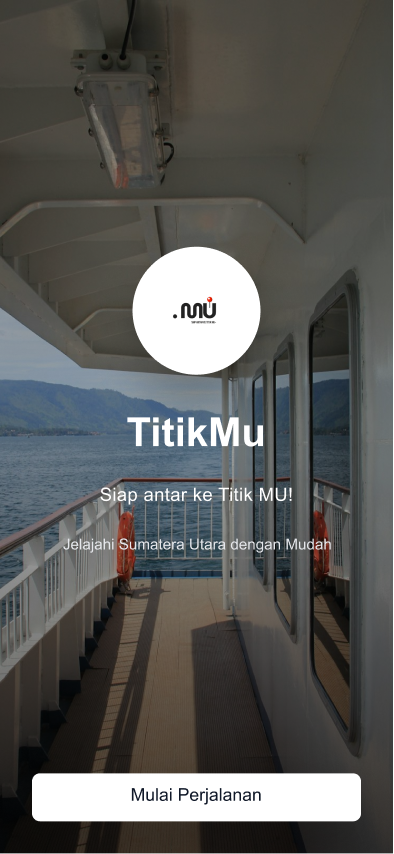

# TitikMu — Bus & Ferry Digital Ticket Platform

**TitikMu (Tiket Sumut)** is an integrated digital ticketing concept for buses and ferries in North Sumatra, focusing primarily on the Lake Toba region. 

 

  
  &nbsp;&nbsp;&nbsp;&nbsp;

## 🎯 Core Value & Solution
* **Centralized System:** Replaces fragmented schedules, untransparent pricing, and scalper risks with a unified platform offering QR-based e-tickets.
* **Local & Intermodal Focus:** The first platform dedicated to seamlessly bridging land (bus) and water (ferry) transport for North Sumatra routes (e.g., KBT, Paradep, Sampri, KMP Ihan Batak).
* **Fast & Secure:** Built for maximum convenience with real-time booking data and secure digital payment integration.

## Design Artifacts
* **[Interactive UI Prototype](https://www.figma.com/design/47HIJ4YVuUbHxkpNdoMrPC/Titikmu-App?node-id=0-1&t=XpwGzz3pisdT3RlH-1)** — Explore the end-to-end booking workflow, operator selection, and user dashboard.
* **[UI Style Guidelines](https://www.figma.com/design/DpIQOGsvuDwzilBzF2RfqZ/UI-Style-Guideline--Community-?node-id=636-5000&p=f&t=elVRsNQlaMgxbHj5-0)** — Inspect our standardized design system, color palettes, and reusable UI components.

## Planned Tech Stack (Future Roadmap)
If transitioned into software development, the planned technical architecture is:
* **Backend & APIs:** FastAPI for low-latency synchronization with local transport operators.
* **Database:** PostgreSQL for secure transaction records and live ticket inventories.
* **Payments:** Gateway integrations (Midtrans, DOKU, GoPay) to encrypt and process transactions.

## Technopreneurship Team (Group 07)
* **Maxwell Avinda Rumahorbo** — Strategic Business Lead & UI Designer
* **Arya Sinambela** — Lead Systems Architecture
* **Grasia Simanullang** — Marketing Strategist & Communications
* **Davina Hutabarat** — Operations & Operator Partnership Lead
* **Dasmauli Sormin** — Financial Management & Feature Analyst